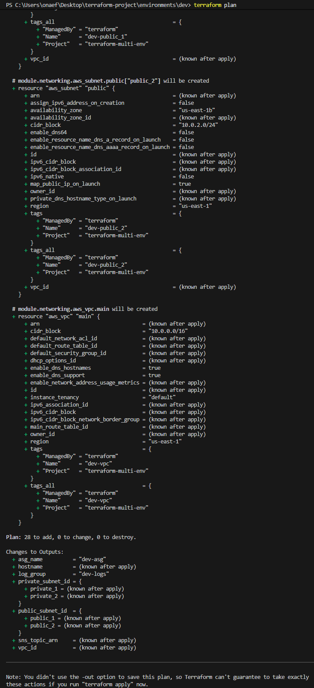
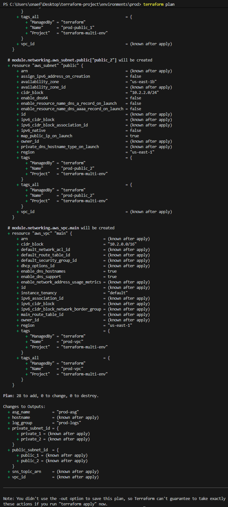
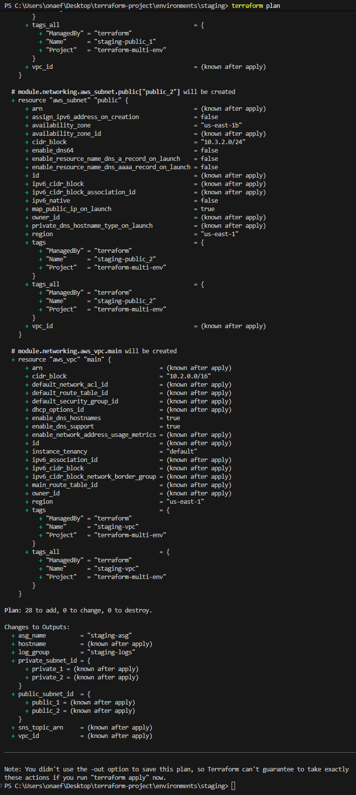

# Terraform Multi-Environment Infrastructure

Terraform project that provisions identical infrastructure across three environments (dev, staging, prod) using reusable modules, with environment-specific sizing and configuration.

## Architecture Diagram

```
┌─────────────────────────────────────────────────────────────────┐
│                        AWS Account                              │
│                                                                 │
│  ┌───────────────────── VPC (10.x.0.0/16) ───────────────────┐  │
│  │                                                            │  │
│  │  ┌──────────────────┐       ┌───────────────────────────┐  │  │
│  │  │  Public Subnets  │       │     Private Subnets       │  │  │
│  │  │                  │       │                           │  │  │
│  │  │  ┌────────────┐  │       │  ┌──────────┐ ┌────────┐  │  │  │
│  │  │  │ NAT Gateway│  │       │  │ EC2 ASG  │ │  RDS   │  │  │  │
│  │  │  └─────┬──────┘  │       │  │(Compute) │ │  (DB)  │  │  │  │
│  │  │        │         │       │  └────┬─────┘ └───┬────┘  │  │  │
│  │  │  ┌─────┴──────┐  │       │       │  SG Ref   │       │  │  │
│  │  │  │    IGW     │  │       │       └───────────┘       │  │  │
│  │  │  └────────────┘  │       │                           │  │  │
│  │  └──────────────────┘       └───────────────────────────┘  │  │
│  │                                                            │  │
│  └────────────────────────────────────────────────────────────┘  │
│                                                                 │
│  ┌─────────────── CloudWatch Monitoring ──────────────────────┐  │
│  │  Log Group  ←  EC2 Instances                               │  │
│  │  CPU Alarm  →  SNS Topic  →  Email Notification            │  │
│  └────────────────────────────────────────────────────────────┘  │
│                                                                 │
│  ┌─────────────── Remote State ───────────────────────────────┐  │
│  │  S3 Bucket (versioned, encrypted, public access blocked)   │  │
│  │  Separate state keys: dev/ staging/ prod/                  │  │
│  └────────────────────────────────────────────────────────────┘  │
└─────────────────────────────────────────────────────────────────┘
```

## Project Structure

```
terraform-multi-env/
├── modules/
│   ├── networking/         
│   │   ├── main.tf
│   │   ├── variables.tf
│   │   └── outputs.tf
│   ├── compute/            
│   │   ├── main.tf
│   │   ├── variables.tf
│   │   └── outputs.tf
│   ├── database/           
│   │   ├── main.tf
│   │   ├── variables.tf
│   │   └── outputs.tf
│   └── monitoring/         
│       ├── main.tf
│       ├── variables.tf
│       └── outputs.tf
├── environments/
│   ├── dev/
│   │   ├── main.tf         
│   │   ├── variables.tf
│   │   ├── outputs.tf
│   │   ├── terraform.tfvars
│   │   └── backend.tf      
│   ├── staging/            
│   └── prod/               
├── backend/                
│   ├── main.tf
│   └── variables.tf
├── .github/
│   └── workflows/
│       └── terraform.yml   
├── infracost.yml
└── README.md
```

## Module Documentation

### Networking

Creates the VPC that contains all resources, including public and private subnets, an internet gateway, NAT gateways, and route tables for traffic within the VPC. Subnets use `for_each` over a map, allowing flexible subnet configuration per environment.

| Input | Type | Description |
|-------|------|-------------|
| `vpc_cidr` | `string` | CIDR block for the VPC |
| `environment` | `string` | Environment name (dev, staging, prod) |
| `common_tags` | `map(string)` | Tags applied to all resources |
| `public_subnets` | `map(object)` | Map of public subnets with CIDR and AZ |
| `private_subnets` | `map(object)` | Map of private subnets with CIDR and AZ |
| `single_nat_gateway` | `bool` | Use one NAT gateway instead of one per AZ |

| Output | Description |
|--------|-------------|
| `vpc_id` | VPC ID |
| `public_subnet` | Map of public subnet IDs |
| `private_subnet` | Map of private subnet IDs |

### Compute

Creates the security group for EC2 instances within the private subnets, allowing SSH connections from a specified CIDR range. Provisions a launch template and an autoscaling group for the EC2 instances.

| Input | Type | Description |
|-------|------|-------------|
| `vpc_id` | `string` | VPC ID from networking module |
| `private_subnet_id` | `list(string)` | Private subnet IDs from networking module |
| `instance_type` | `string` | EC2 instance type |
| `ami_id` | `string` | AMI ID for EC2 instances |
| `key_pair` | `string` | Key pair name for SSH access |
| `asg_sizes` | `object` | Min, max, and desired capacity for the ASG |
| `allowed_ssh_cidr` | `string` | CIDR range allowed to SSH into instances |
| `environment` | `string` | Environment name |
| `common_tags` | `map(string)` | Tags applied to all resources |

| Output | Description |
|--------|-------------|
| `security_group_id` | Compute security group ID |
| `autoscaling_group_name` | ASG name |

### Database

Contains the security group for the database, allowing inbound connections only from the compute security group. Provisions an RDS instance with configurable engine, instance class, and storage. Since the module accepts engine and version as variables, it supports any relational database the user chooses (PostgreSQL, MySQL).

| Input | Type | Description |
|-------|------|-------------|
| `vpc_id` | `string` | VPC ID from networking module |
| `private_subnet_id` | `list(string)` | Private subnet IDs for DB subnet group |
| `compute_security_group_id` | `string` | Compute SG ID for ingress rules |
| `database_name` | `string` | Database name |
| `database_username` | `string` | Master username |
| `database_password` | `string` | Master password (sensitive) |
| `database_engine` | `string` | Database engine (postgres, mysql) |
| `database_engine_version` | `string` | Engine version |
| `database_instance_type` | `string` | RDS instance class |
| `database_storage` | `number` | Allocated storage in GB |
| `multi_az` | `bool` | Enable Multi-AZ deployment |
| `environment` | `string` | Environment name |
| `common_tags` | `map(string)` | Tags applied to all resources |

| Output | Description |
|--------|-------------|
| `hostname` | RDS instance address (hostname) |
| `database_name` | Database name |
| `database_port` | Database port (5432 or 3306) |

### Monitoring

Collects logs from the application tier using CloudWatch, monitors CPU utilization on the ASG, and triggers an alarm when usage exceeds the configured threshold. Notifications are sent to a specified email address via SNS.

| Input | Type | Description |
|-------|------|-------------|
| `environment` | `string` | Environment name |
| `common_tags` | `map(string)` | Tags applied to all resources |
| `asg_name` | `string` | ASG name from compute module |
| `cpu_threshold` | `number` | CPU percentage threshold for alarm |
| `retention_in_days` | `number` | CloudWatch log retention period |
| `email` | `string` | Email address for alarm notifications |

| Output | Description |
|--------|-------------|
| `sns_topic_arn` | SNS topic ARN |
| `log_group` | CloudWatch log group name |

## Usage Instructions

### Prerequisites

- Terraform 1.10 or later
- AWS CLI configured with appropriate credentials
- An AWS account with permissions for VPC, EC2, RDS, CloudWatch, and SNS

### Deploying an Environment

1. Clone the repository:
   ```bash
   git clone <repository-url>
   cd terraform-multi-env
   ```

2. Navigate to the desired environment:
   ```bash
   cd environments/dev
   ```

3. Set the database password (do not store this in files):
   ```bash
   export TF_VAR_database_password="your-secure-password-here"
   ```
   On PowerShell:
   ```powershell
   $env:TF_VAR_database_password = "your-secure-password-here"
   ```

4. Initialize Terraform:
   ```bash
   terraform init
   ```

5. Format and validate:
   ```bash
   terraform fmt -check
   terraform validate
   ```

6. Review the execution plan:
   ```bash
   terraform plan
   ```

Repeat for `staging` and `prod` environments.

## Plan Output

### Dev Output


### Production Output


### Staging Output


### Remote State Backend

The S3 backend configuration is commented out in each environment's `backend.tf`. To enable it:

1. First, provision the S3 bucket using the config in `backend/`.
2. Uncomment the backend block in the target environment's `backend.tf`.
3. Run `terraform init` to migrate state to S3.

Each environment uses a separate state key (`dev/terraform.tfstate`, `staging/terraform.tfstate`, `prod/terraform.tfstate`) within the same bucket. State locking uses `use_lockfile = true` (DynamoDB is not required).

## Environment Differences

| Setting | Dev | Staging | Prod |
|---------|-----|---------|------|
| Instance Type | t3.micro | t3.small | t3.medium |
| ASG (min/max/desired) | 1/1/1 | 1/2/1 | 1/5/3 |
| DB Instance | db.t3.micro | db.t3.small | db.t3.medium |
| DB Storage | 20 GB | 30 GB | 50 GB |
| Multi-AZ | No | No | Yes |
| NAT Gateway | Single | Single | Single |
| VPC CIDR | 10.0.0.0/16 | 10.3.0.0/16 | 10.2.0.0/16 |
| CPU Alarm Threshold | 80% | 70% | 60% |
| Log Retention | 14 days | 30 days | 365 days |

## Security

- **Database network isolation:** The database security group only allows inbound traffic from the compute security group, referenced by security group ID rather than CIDR. This ensures only application instances can reach the database without over-privileging access.
- **Database authentication:** Access to the database requires a username and password known only to the administrator. The password is marked as `sensitive` in Terraform and is never stored in `.tfvars` files.
- **Password handling:** The database password is set via the `TF_VAR_database_password` environment variable rather than being committed to source control. In CI/CD, it is stored as a GitHub Actions encrypted secret.
- **RDS encryption:** Storage encryption is enabled on all database instances (`storage_encrypted = true`).
- **Remote state encryption:** The S3 state bucket uses AES-256 server-side encryption and blocks all public access.
- **SSH access:** Inbound SSH is restricted to a specific CIDR range per environment, not open to the internet.

## CI/CD

A GitHub Actions workflow runs on every pull request to `main`. It performs the following for each environment (dev, staging, prod) in parallel:

1. `terraform fmt -check` — ensures consistent formatting
2. `terraform init` — initializes providers and modules
3. `terraform validate` — checks configuration syntax and references
4. `terraform plan` — previews infrastructure changes

After all environments pass, a separate Infracost job runs a cost breakdown across all three environments.

## Tagging Strategy

All resources use a consistent tagging pattern:

```hcl
tags = merge(var.common_tags, {
  Name = "${var.environment}-resource-name"
})
```

Common tags (`Project`, `ManagedBy`) are defined once in `terraform.tfvars` and merged with resource-specific tags in every module, ensuring traceability and cost allocation across all environments.
